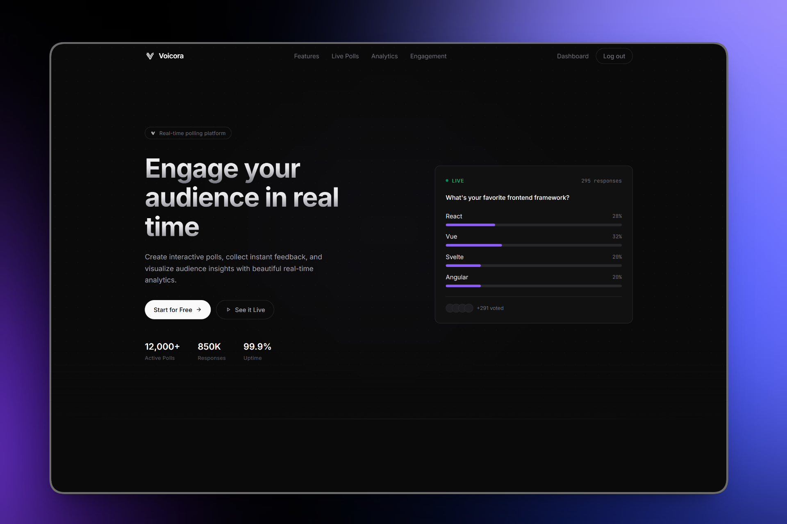
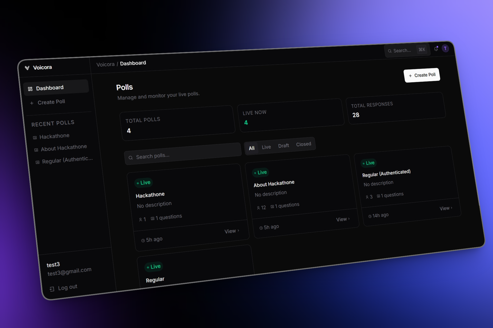
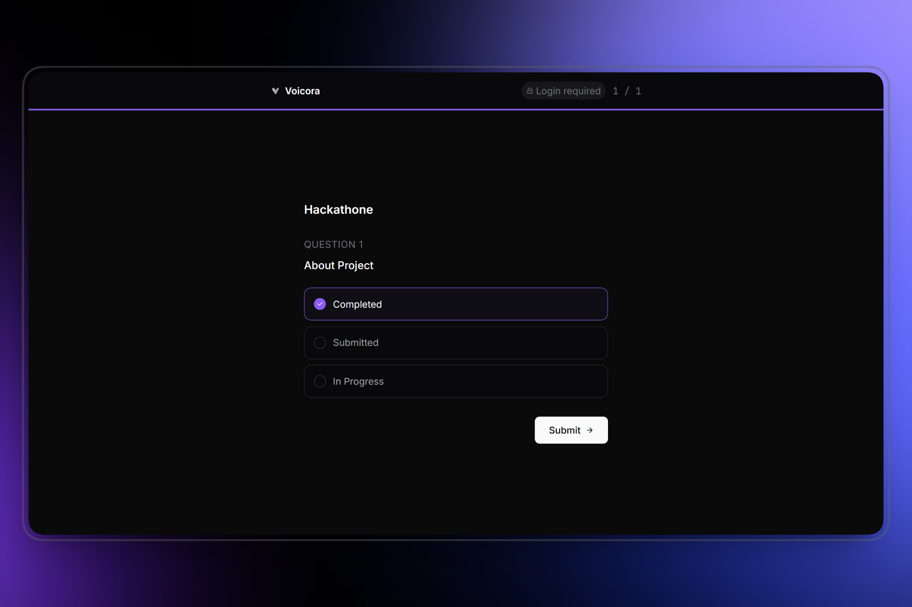
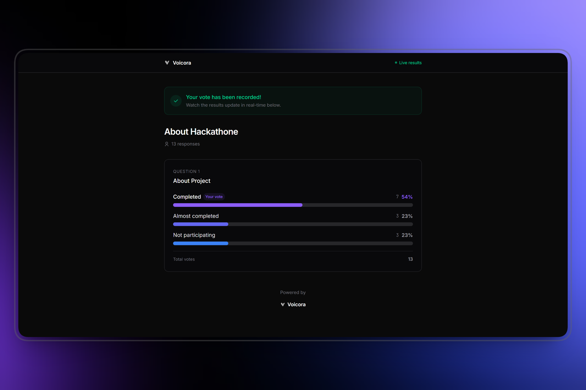

# Voicora

Voicora is a real-time live polling platform that allows users to create interactive polls and gather responses instantly. Built with a modern tech stack, it features seamless real-time updates using WebSockets, secure authentication, and a responsive, dynamic UI.

## 🚀 Features
- **Real-Time Polling**: Live results update instantly as users submit responses via Socket.io.
- **Authentication**: Secure user registration and login with JWT and bcrypt.
- **Poll Management**: Create, view, and manage interactive polls.
- **Data Visualization**: Beautiful, real-time charts using Recharts.
- **Responsive Design**: Optimized for all devices with Tailwind CSS and smooth animations via Framer Motion.

## 🛠️ Tech Stack
**Frontend**:
- React 19 (Vite)
- Tailwind CSS
- Socket.io-client
- React Router DOM
- Axios

**Backend**:
- Node.js & Express
- TypeScript
- MongoDB & Mongoose
- Socket.io
- JWT Authentication
- Zod (Validation)
## 📂 Folder Structure

```
voicora/
├── backend/            # Express + TypeScript server
│   ├── scripts/        # Database scripts
│   ├── src/            # Backend source code
│   │   ├── modules/    # Domain modules (auth, poll, response)
│   │   ├── server.ts   # Entry point
│   │   └── ...
│   └── package.json    # Backend dependencies
└── frontend/           # React + Vite application
    ├── public/         # Static assets
    ├── src/            # Frontend source code
    │   ├── components/ # Reusable UI components
    │   ├── pages/      # Route components
    │   ├── App.jsx     # Main React component
    │   └── ...
    └── package.json    # Frontend dependencies
```

## 🌐 API Overview

The backend follows a modular REST API structure:
- **/api/auth**: Endpoints for user registration, login, and authentication state.
- **/api/poll**: Endpoints to create, read, and manage polls.
- **/api/response**: Endpoints to submit and retrieve poll responses.
Real-time events are emitted over WebSockets for live result updates.

## 🔗 Deployment
- **Frontend**: [https://voicoraa.vercel.app](https://voicoraa.vercel.app)
- **Backend API**: [https://voicora-backend.onrender.com](https://voicora-backend.onrender.com)

## ⚙️ Environment Variables

To run this project, you will need to add the following environment variables.

### Frontend (`frontend/.env`)
```env
VITE_API_URL=http://localhost:8000/api
VITE_SOCKET_URL=http://localhost:8000
```

### Backend (`backend/.env`)
```env
PORT=8000
NODE_ENV=development
MONGODB_URI=your_mongodb_connection_string
JWT_SECRET=your_super_secret_jwt_key
JWT_EXPIRES_IN=7d
CLIENT_URL=http://localhost:5173
```

## 💻 Run Locally

Clone the project
```bash
git clone https://github.com/your-username/voicora.git
```

Go to the project directory
```bash
cd voicora
```

**1. Start the Backend**
```bash
cd backend
npm install
npm run dev
```

**2. Start the Frontend**
Open a new terminal:
```bash
cd frontend
npm install
npm run dev
```

## Screenshots





